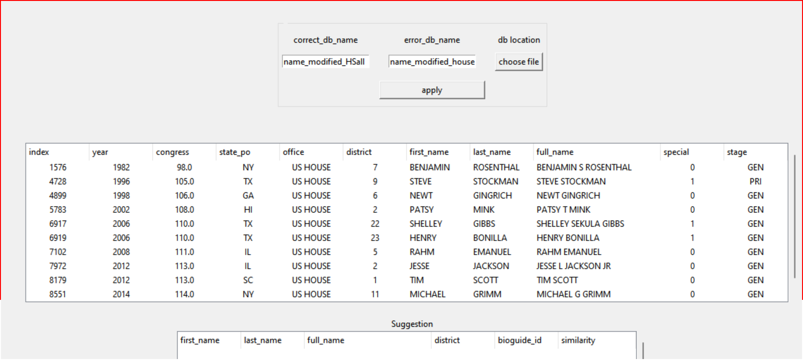
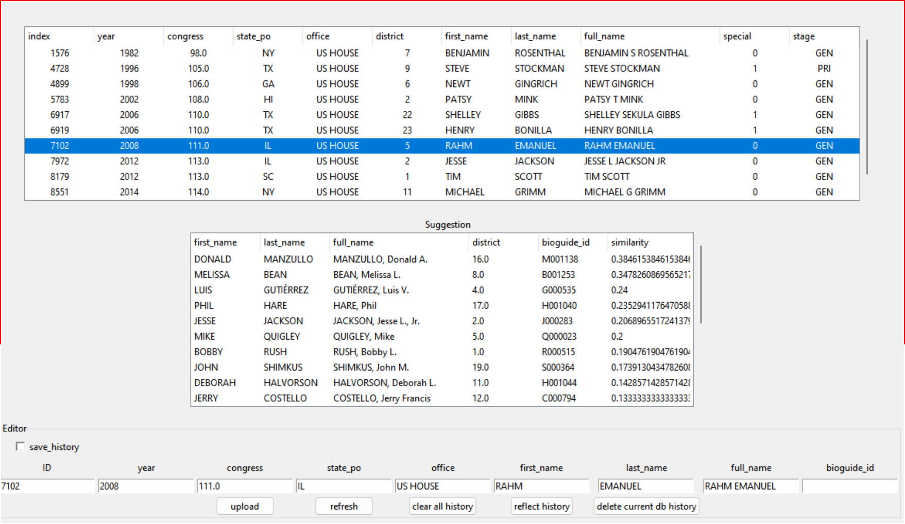

# vote_mandate_project

## Description

The main purpose of this python program is to generate variables that are used for election and politician types research.

Variables that this program generates are described below
 

### nokken_poole_dim1
- **Description**: Nokken-Poole First dimension estimate but absoulte value.

---
### abs_nokken_poole_dim1
- **Description**: Nokken-Poole First dimension estimate but absoulte value.

---
### vote_share
- **Description**: It represents the vote shares for the candidate of the respective election they had.

---
### dems_vote_share_district

- **Description**: It represents the total Democratic party vote shares in the particular district (If many other parties support a single candidate, we combine all the votes and consider it as the major party votes).
---
### gop_vote_share_district
- **Description**: It represents the total Democratic party vote shares in the particular district (If many other parties support a single candidate, we combine all the votes and consider it as the major party votes).
---
### dems_vote_share_state
- **Description**: It represents the total Democratic party vote shares in the particular state (If many other parties support a single candidate, we combine all the votes and consider it as the major party votes).
---

### gop_vote_share_state
- **Description**: It represents the total Republican party vote shares in the particular state (If many other parties support a single candidate, we combine all the votes and consider it as the major party votes).
---
### recent_dems_vote_share_senate
- **Description**: It represents the Democrat vote shares of the Senator with the lowest subterm value (most recent election result of the particular state for a senator).
---
### recent_gop_vote_share_senate

- **Description**: It represents the Republican vote shares of the Senator with the lowest subterm value (most recent election result of the particular state for a senator).
---

### recent_dems_vote_share_house
- **Description**: It represents the Democrat vote shares of the congressman with the most recent election result of the particular state (basically same as dems_vote_share_state for the House election).
---

### recent_gop_vote_share_house
- **Description**: It represents the Republican vote shares of the congressman with the most recent election result of the particular state (basically same as gop_vote_share_state for the House election).
---

### dems_avg_vote_share_senate
- **Description**: It represents the average Democrat vote shares of the two senators for that state/year. (Only rows with chamber = 'senate' have this value)
---

### gop_avg_vote_share_senate
- **Description**: It represents the average Republican vote shares of the two senators for that state/year. (Only rows with chamber = 'senate' have this value)
---

### dems_pres_vote_share
- **Description**: democrat vote shares of the most recent presidential election.
---

### gop_pres_vote_share
- **Description**: republican vote shares of the most recent presidential election.
---
### subterm
- **Description**: subterm for senator
---

The more explanation of each variable is described in codebook-merged_nokken_pool_1976_2020.md file.

There are three big parts of this program.
The big three parts consist of upload, converter, User interface. 

The Upload file is "politic_info_upload.py"
The Converter files are "h_s_converter", "hsall_converter", "president_converter", "ultimate_converter"
The ui part is consist of "name_app_controller", "name_app_model" and "name_app_view".

The main.py file instantiate and calls the classes and runs in the proper order.

---
## UPLOAD (politic_info_upload.py file).
        
The main purpose of this part is to upload all the csv file into the sqlite database which is total_info.db

The csv file it is uploading : '1976-2020-senate.csv', '1976-2020-house.csv','1976-2020-president.csv','HSall_members.csv'

The name of each table that is uploaded: 'from1976to2020_senate','from1976to2020_house','from1976to2020_president','HSall_members'

---
## CONVERTER (h_s_converter, hsall_converter,president_converter).
        
The main purpose of this converter python files is to convert all the data in the 
total_info.db('from1976to2020_senate','from1976to2020_house','from1976to2020_president','HSall_members')
to be compatible to merge.

Frist, h_s_converter convert 
        
### h_s_converter: 
This Python script is designed to convert and correct names in a database, 
specifically for House and Senate elections. It uses the SQLite library and Pandas for data manipulation and analysis.

- **Features**

The script provides the following features:

1. Upload a DataFrame to an SQLite database.
2. Retrieve a DataFrame from an SQLite database.
3. Convert the House and Senate databases, adding Democratic and Republican votes(respective districts and states).
4. Interpret names to discern first and last names.
5. Check for erroneous names in the database based on similarity.
6. Check for party changes in the database.
7. Reflect the name correction history stored in the database.(we can store the correction history using UI)
8. Automatically correct names using a separate database of correct names and bioguide IDs.

- **Usage**

1. Establish a connection to your SQLite database.
2. Create an instance of the h_s_converter class, passing the database connection as a parameter.
3. Use the class methods to perform the desired operations, such as uploading a DataFrame, converting the database, checking names, and correcting names.
4. The results can be stored in a new table or retrieved as a DataFrame for further analysis or processing.

- **Example**

```python
import sqlite3
import pandas as pd

# Import the h_s_converter class from the script
from h_s_converter import h_s_converter

# Establish a connection to the SQLite database
conn = sqlite3.connect('database.db')

# Create an instance of the h_s_converter class
converter = h_s_converter(conn)

# Upload a DataFrame to the database
df = pd.DataFrame(...)
converter.upload_df_to_database(df, 'table_name')

# Convert the House or Senate database
converted_df = converter.convert_database('H')

# Check for erroneous names in the database
error_names_df = converter.check_names(converted_df, 0.9)

# Automatically correct names using a separate database
corrected_df = converter.auto_correct_names(error_names_df, correct_names_df, 0.8)

# Retrieve a DataFrame from the database
retrieved_df = converter.retrieve_df_from_database('table_name')

# Close the database connection
conn.close()
```

### hsall_converter
The hsall_converter class is designed to convert and interpret data from the "HSall_members" database and store the modified data in the "name_modified_HSall" table. It also includes a function to upload a DataFrame to the database.

- **Features**

The script provides the following features:

'upload_df_to_database(df: pd.DataFrame, name: str)':

    Uploads a DataFrame to the SQLite database with the given name. 
    If the table already exists, it will be replaced.

'convert_HSall_database()':

    Retrieves data from the "HSall_members" table and interprets names to discern first name and last name.
    The modified data is stored in the "name_modified_HSall" table. 
    Any names that cannot be interpreted are stored in the "HSall_undefined_names" table.

    Returns: The modified DataFrame containing the interpreted names.

- **Usage**

1. Establish a connection to your SQLite database.
2. Create an instance of the h_s_converter class, passing the database connection as a parameter.
3. Use the class methods to perform the desired operations, such as uploading a DataFrame, converting the database, checking names, and correcting names.
4. The results can be stored in a new table or retrieved as a DataFrame for further analysis or processing.

- **Example**

```python
# Initialize SQLite connection
conn = sqlite3.connect('your_database_file.db')

# Create an instance of hsall_converter
converter = hsall_converter(conn)

# Convert and interpret HSall database
modified_df = converter.convert_HSall_database()

# Close the connection
conn.close()
```

### president_converter

The president_converter class is designed to convert and interpret data from a database containing information about US Presidential elections. It performs various operations on the data, including name interpretation, auto-correcting names based on similarity, and creating a modified table containing aggregated election data for major candidates (Democrats and Republicans) for each year.


- **Features**

'upload_df_to_database(df: pd.DataFrame, name: str)':
    
    Uploads a DataFrame to the SQLite database with the given name. If the table already exists, it will be replaced.

'retrieve_df_from_db(table_name: str)':

    Retrieves a DataFrame from the SQLite database based on the provided table name.

'convert_database()':

    Performs various database operations to create a modified table named "name_modified_president" containing aggregated election data for major candidates (Democrats and Republicans) for each year.

'auto_correct_names(df_error_names: pd.DataFrame, df_correct_names: pd.DataFrame, limit_similarity: float)':

    Automatically assigns names from the HSALL database to the names in the "name_modified_president" database using similarity. The limit_similarity parameter determines the minimum similarity required for the auto-correction.

'interpret_names(df: pd.DataFrame)':

    Interprets names and sets first and last names according to the names in the DataFrame.

- **Example**

```python
# Initialize SQLite connection
conn = sqlite3.connect('your_database_file.db')

# Create an instance of president_converter
converter = president_converter(conn)

# Convert the database
converter.convert_database()

# Retrieve the modified DataFrame from the database
modified_df = converter.retrieve_df_from_db('name_modified_president')

# Close the connection
conn.close()
```

### ultimate_converter

The ultimate_converter class is designed to perform various data manipulation and merging operations on three different databases containing information about US House, US Senate, and US Presidential elections. It merges the data from these databases and adds additional columns to create a final, comprehensive dataset containing vote share information for different candidates in various elections.


- **Features**

'upload_df_to_database(df: pd.DataFrame, name: str)':
    
    Uploads a DataFrame to the SQLite database with the given name. If the table already exists, it will be replaced.

'merge_nokken_poole_with_h_s()':

    Merges the HSALL database with the House and Senate databases using a LEFT JOIN operation based on common fields such as bioguide_id or candidate name, state, congress, and chamber. The result is stored in a new table named "merged_nokken_pool".

'add_pres_vote_share()':

    Adds presidential election vote share for Democrats and Republicans to the "merged_nokken_pool" table. It calculates the vote share for the most recent presidential election for each congress.

'add_subterm_senate()':

    Adds a "subterm" column to the "merged_nokken_pool" table. The "subterm" indicates if the senators are serving their first, second, or third term since they have a 6-year term. It calculates the subterm for each senator based on their vote share data.

'add_recent_avg_senate_vote_share()':

    Adds recent and average vote share for Senate candidates to the "merged_nokken_pool" table. The recent vote share refers to the most recent vote share for senatorial elections in the same state. The average vote share is the average vote share for Senate candidates for each year and state.

'create_result_table()':
    
    Drops all rows that do not have vote share data and saves the modified dataset to a new table named "merged_nokken_poole_1976_2020". This table will contain the final, comprehensive dataset with vote share information for different candidates in various elections.

- **Example**

```python
# Initialize SQLite connection
conn = sqlite3.connect('your_database_file.db')

# Create an instance of ultimate_converter
converter = ultimate_converter(conn)

# Merge HSALL data with House and Senate data
converter.merge_nokken_poole_with_h_s()

# Add presidential election vote share
converter.add_pres_vote_share()

# Add subterm for Senate candidates
converter.add_subterm_senate()

# Add recent and average vote share for Senate candidates
converter.add_recent_avg_senate_vote_share()

# Create the final result table
converter.create_result_table()

# Close the connection
conn.close()
```

The methods in the ultimate_converter class perform complex operations, so make sure you have the required data in the database before executing them

---

## Graphic User Interface for manual name correction (UI)

This program is only graphic interface in this program which is used to manually assign names from hsall to the names in other dataset. 

This program is used when auto_correction in converter is not enough to match all the names in the dataset. 

This program consist of controller, model and view (name_app_view.py, name_app_model.py, name_app_controller.py)




correct_db_name : name of the table in the sqlite database that has correct names and bioguide id -> should be hsall data.

error_db_name: name of the table in the sqlite database that has names that should be compared with correct_db_name ->senate, house, president data.

db location: where the sqlite database exists.

first window that has a long list of columns is to show the list of unmatched names from error_db_name table.

IF you clicked the one of row in the list then it shows the list of suggested list of names that comes from hsall dataset. 

In the editor section, it shows all the necessary information of the rows that are clicked.

if you cliked the one of the rows in the suggestion list, the name boxes and bioguide_id box are updated accordingly in the editor section. 

upload button: it updates the error_db_name table in the database according to the information in the boxes in editor(it updates names and bioguide_id usually)

refresh button: it retrieves the data from the db again and shows the list of names in the first windows.


save history check button: if you upload the modified information and changed the db when save_history button is cliked, it saves all the history of modification in the database so that it can be used later. 

clear all history button: it clears all the history in the history table in the database

reflect history button: it reflects all the past modification history to current one so that you do not have to upload everythin again. 

delete current db history button: it deleted only history of current "error_db_name" table (not all the history)



  